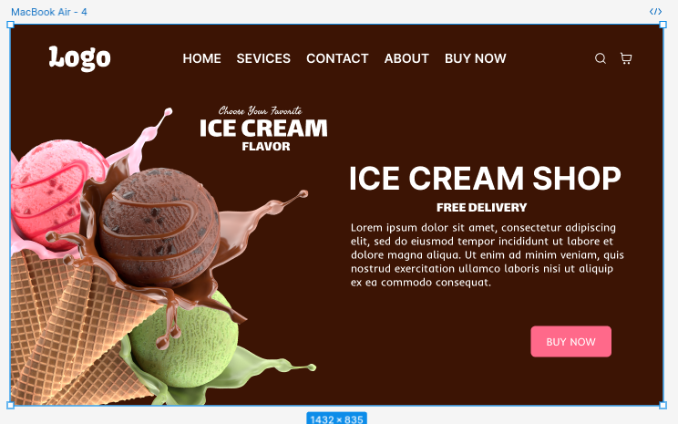

# 🍦 Ice Cream Shop

¡Bienvenido a **Ice Cream Shop**! 🎉 Una página web moderna y llamativa, diseñada con **HTML y CSS** para promocionar y vender los helados más deliciosos. 🍨✨

## 📸 Captura de Pantalla



## 📜 Tabla de Contenidos

1️⃣ [Introducción](#introducción)

2️⃣ [Características](#características)

3️⃣ [Instalación](#instalación)

4️⃣ [Uso](#uso)

5️⃣ [Ejemplos](#ejemplos)

6️⃣ [Contribuciones](#contribuciones)

7️⃣ [Licencia](#licencia)

------

## 🏁 Introducción

**Ice Cream Shop** es una **landing page** creada con **HTML y CSS** que ofrece una experiencia visual atractiva y envolvente. Ideal para quienes desean inspirarse en diseño web o usarla como base para su propio proyecto de comercio electrónico.

👨‍💻 **Tecnologías utilizadas:**

✅ **HTML5** - Estructura del sitio.

✅ **CSS3** - Estilos y animaciones.

------

## ✨ Características

✔️ **Diseño moderno y llamativo** con imágenes impactantes.

✔️ **100% responsive**, adaptable a móviles y tablets. 📱💻

✔️ **Animaciones y transiciones suaves** usando solo **CSS**.

✔️ **Sección de compra rápida** para mejorar la conversión. 🛒

✔️ **Botón de llamada a la acción** para atraer clientes. 🔥

------

## ⚙️ Instalación

Para ver el proyecto en tu equipo local, sigue estos pasos:

1️⃣ **Clona el repositorio:**

```
bashCopiarEditargit clone https://github.com/usuario/ice-cream-shop.git
cd ice-cream-shop
```

2️⃣ **Abre el archivo `index.html` en tu navegador:**

- Si usas un sistema gráfico, haz doble clic en el archivo.
- Si usas VS Code, puedes abrirlo con **Live Server**.

------

## 🚀 Uso

El proyecto **NO** necesita instalación de dependencias, ya que está hecho solo con **HTML y CSS**.

### 🖌 Personalización

Si deseas modificar colores, fuentes o imágenes:

1. Abre el archivo `style.css`.
2. Cambia las propiedades que desees.
3. Guarda y refresca el navegador.

------

## 📝 Ejemplos

Aquí tienes algunos ejemplos de cómo luce el código:

✅ **Estructura básica en `index.html`:**

```
htmlCopiarEditar<header>
  <h1>Ice Cream Shop</h1>
  <p>El mejor helado, directo a tu puerta 🍦🚀</p>
</header>
```

✅ **Ejemplo de estilo en `style.css`:**

```
cssCopiarEditarh1 {
  color: #fff;
  font-size: 2.5rem;
  text-align: center;
}
```

------

## 🤝 Contribuciones

Las contribuciones son bienvenidas. ¡Siéntete libre de mejorar el proyecto!

### 📌 Pasos para contribuir:

1️⃣ Haz un **fork** del repositorio.

2️⃣ Crea una **nueva rama** con tu mejora:

```
bash


CopiarEditar
git checkout -b feature/nueva-funcion
```

3️⃣ Realiza un **pull request** con tus cambios.

------

## 📄 Licencia

Este proyecto está bajo la **licencia MIT**. Consulta el archivo `LICENSE` para más detalles.

------

🚀 ¡Esperamos que disfrutes el proyecto! Si te gusta, ⭐ dale un **star** en GitHub. 😃